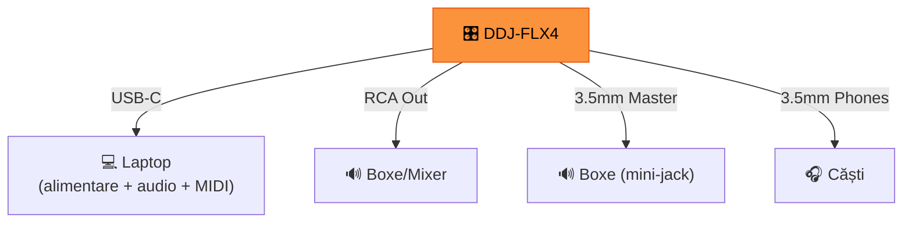

# 🎛️ DDJ-FLX4 — Ghid Complet

[🏠 Home](../README.md) · [🔌 Echipament](../README.md#-echipament)

---

> **Pe scurt:** Tot ce trebuie să știi despre DDJ-FLX4 — controller-ul tău principal.

---

## 📋 Specificații

| Specificație | Valoare |
|-------------|---------|
| **Canale** | 2 |
| **Jog Wheels** | 2× 4.39" cu platou aluminiu |
| **Performance Pads** | 16 (8 per deck) |
| **Faders** | 2 channel + 1 crossfader |
| **EQ** | 2-band per canal (Hi/Lo) |
| **FX** | Smart CFX knob per canal |
| **Conectivitate** | USB-C (bus powered) |
| **Audio Out** | RCA (Master) + 3.5mm (Master) + 3.5mm (Headphones) |
| **Compatibilitate** | rekordbox, Serato DJ, djay |
| **Dispozitive** | Windows, Mac, iOS, Android |
| **Greutate** | 1.8 kg |

---

## 🎛️ Layout Complet

```
┌──────────────────────────────────────────────────────────┐
│                                                          │
│  [BROWSE]  ◉ rotary encoder                              │
│                                                          │
│  ┌────────────────┐         ┌────────────────┐           │
│  │                │         │                │           │
│  │   JOG WHEEL    │  MIXER  │   JOG WHEEL    │           │
│  │    DECK A      │         │    DECK B      │           │
│  │                │ [Hi] [Hi│]               │           │
│  └────────────────┘ [Lo] [Lo│] ────────────────┘          │
│                     [CFX][CFX]                            │
│  [TEMPO ▲]         [VOL][VOL]         [TEMPO ▲]         │
│  [TEMPO ▼]                            [TEMPO ▼]         │
│                  ═══CROSSFADER═══                         │
│  [1][2][3][4]                         [1][2][3][4]       │
│  [5][6][7][8]    PERFORMANCE PADS     [5][6][7][8]       │
│                                                          │
│  [HOT CUE][PAD FX][BEAT JUMP][SAMPLER]                   │
│  [▶PLAY] [CUE] [SYNC]    [SYNC] [CUE] [PLAY▶]          │
│  [SHIFT]                                [SHIFT]          │
└──────────────────────────────────────────────────────────┘
```

---

## ✨ Features Unice DDJ-FLX4

### Smart Fader
Crossfader inteligent care face EQ switch + volume transition automat.
Perfect pentru începători — o singură mișcare = tranziție curată.

### Smart CFX (Color FX)
Un knob per canal care aplică un efect complex (filter + echo combo).
Simplu dar eficient.

### Merge FX
Combo de efecte pentru tranziții dramatice. Apasă butonul dedicat
pentru a activa un FX preset pe tranziție.

### Jog Cutter
Scratch automat — mișcă jog wheel-ul și DDJ face scratch patterns automat.

---

## 🔌 Conexiuni



> **Bus powered** — nu ai nevoie de alimentator extern. USB-C de la laptop e suficient.

---

## 🎹 Performance Pads — 4 Moduri

| Mod | Pad 1-8 | Când Folosești |
|-----|---------|----------------|
| **Hot Cues** | Salt la 8 cue points | Tot timpul |
| **Pad FX** | 8 efecte instant | Tranziții, Build-uri |
| **Beat Jump** | Salt ±1, 2, 4, 8, 16, 32 beats | Navigare rapidă |
| **Sampler** | 8 sample slots | Adaugi elemente live |

---

## 📈 Limitări vs. Upgrade

| DDJ-FLX4 | Ce nu are | Upgrade care rezolvă |
|----------|----------|---------------------|
| 2 canale | Max 2 track-uri | DDJ-FLX10 (4ch) |
| EQ 2-band | Nu ai Mid separat | DDJ-1000 (3-band) |
| No audio input | Nu poți intra cu CT direct | Mixer extern |
| Fader scurt | Mai puțin control | DDJ-1000+ |
| No standalone | Depinde de laptop | XDJ-RX3 |

> **💡 Sfat:** DDJ-FLX4 e **excelent** pentru începători și intermediate.
> Investește în **mixer extern** înainte de a upgrada controller-ul.

---

[🏠 Home](../README.md) · [🔌 Echipament](../README.md#-echipament)
