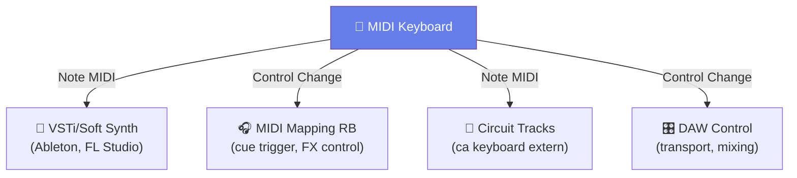

# 🎹 MIDI Keyboard — Performanță Live

[🏠 Home](../README.md) · [🔌 Echipament](../README.md#-echipament)

---

> **Pe scurt:** Cum integrezi un MIDI keyboard (de la vărul) în setup-ul DJ
> pentru performanță live și producție.

---

## 🎹 Ce Poți Face cu un MIDI Keyboard

---

## 🔗 Conectare

| Tip Conectare | Când | Setup |
|--------------|------|-------|
| **USB** | Direct la laptop | MIDI Keyboard → USB → Laptop |
| **MIDI Out → CT** | Layer-are pe Circuit Tracks | MIDI Keyboard → MIDI Out → CT MIDI In |
| **USB + Audio Interface** | Setup pro complet | MIDI Keyboard → Laptop → Audio Interface → Mixer |

---

## 🎵 Utilizări în Performanță

### 1. **Live Melody** peste DJ Mix
- Cântă melodii/riff-uri live pe un VSTi
- Audio-ul merge separat în mixer
- Perfect pentru: breakdown-uri, build-up-uri

### 2. **Synth Control** cu Circuit Tracks
- Conectează MIDI keyboard la CT prin MIDI
- Ai control polifonic asupra synth-urilor CT
- CT-ul devine un modul synth cu keyboard real

### 3. **FX Control** în Rekordbox
- Mapează knoburi/faders de pe keyboard la parametri RB
- FX Depth, Filter cutoff, etc.
- More expressive than built-in DDJ knobs

### 4. **Sample Trigger**
- Declanșează samples din keyboard note
- Perfect pentru one-shots, vocals, SFX

---

## 🎯 Genuri Ideale pentru MIDI Keyboard

| Gen | Cum | Dificultate |
|-----|-----|-------------|
| **Acid** | Bassline live 303-style | 🟡 Mediu |
| **Techno** | Stabs, chords, pads | 🟢 Ușor |
| **Psy** | Arpeggio-uri rapide | 🔴 Greu |
| **Manele** | Melodii orientale live | 🔴 Greu |
| **Bounce** | Lead synth hooks | 🟡 Mediu |

---

## ⚠️ Sfaturi Practice

| Regulă | De Ce |
|--------|-------|
| **Practică fără public** întâi | Live keyboard e greu — greșelile se aud |
| **Setează volum scăzut** | Poți crește, dar nu vrei explozie sonoră |
| **Sounds simple** | Un pad sau lead, nu orchestră |
| **Cunoaște tonalitatea** | Același key ca track-ul DJ! |
| **Aveți un plan B** | Dacă nu merge, oprește și continuă fără keyboard |

---

[🏠 Home](../README.md) · [🔌 Echipament](../README.md#-echipament)
