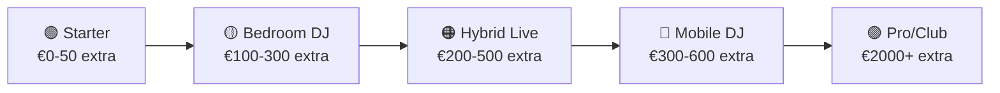

# 🏗️ Setup-uri Recomandate — Per Nivel

[🏠 Home](../README.md) · [🔌 Echipament](../README.md#-echipament)

---

> **Pe scurt:** Setup-uri complete organizate per nivel de experiență și buget.

---

## 🗺️ Overview



---

## 🟢 Setup 1: Starter (Ce ai acum)

| Componentă | Model | ✅/🔜 |
|-----------|-------|------|
| Controller | DDJ-FLX4 | ✅ |
| Laptop | Laptop personal | ✅ |
| Căști | Căști personale | ✅ |
| Software | rekordbox (Free/Core) | ✅ |

**Total extra:** €0
**Ce poți face:** Mix basic 2 canale, export USB

---

## 🟡 Setup 2: Bedroom DJ

| Componentă | Model | ✅/🔜 |
|-----------|-------|------|
| Controller | DDJ-FLX4 | ✅ |
| Laptop | Laptop personal | ✅ |
| Căști | Audio-Technica ATH-M50x | 🔜 €130 |
| Boxe monitor | KRK Rokit 5 G4 (pereche) | 🔜 €300 |
| Software | rekordbox Core | ✅ |

**Total extra:** ~€150-400
**Ce poți face:** Mix de calitate, pregătire seturi acasă

---

## 🟠 Setup 3: Hybrid Live (Scopul Tău)

| Componentă | Model | ✅/🔜 |
|-----------|-------|------|
| Controller | DDJ-FLX4 | ✅ |
| Groovebox | Circuit Tracks | ✅ |
| MIDI Keyboard | (de la vărul) | ✅ |
| Mixer extern | Yamaha MG06X sau similar | 🔜 €80 |
| Laptop | Laptop personal | ✅ |
| Căști | Bune (over-ear, closed) | 🔜 |
| Cabluri | 3.5→RCA, USB, RCA→RCA | 🔜 €30 |

```
┌──────────────────────────────────────────────────┐
│                    SETUP HYBRID                   │
│                                                  │
│  [MIDI Keyboard]──USB──┐                         │
│                        │                         │
│  [Circuit Tracks]──USB─┼──💻 LAPTOP──USB-C──┐    │
│     └──3.5mm──┐        │                    │    │
│               │        │              [DDJ-FLX4]  │
│               ▼        │                │ RCA     │
│          [MIXER EXTERN]◄────────────────┘        │
│               │                                  │
│               ▼                                  │
│         [🔊 BOXE]                                │
│                                                  │
│            [🎧 Căști din DDJ]                    │
└──────────────────────────────────────────────────┘
```

**Total extra:** ~€110
**Ce poți face:** DJ + live synth + keyboard overlay = performanță unică

---

## 🔴 Setup 4: Mobile DJ (Gig-uri)

| Componentă | Model |
|-----------|-------|
| Tot din Setup 3 | ✅ |
| PA Speakers | 2× active (EV ZLX-12BT sau similar) |
| Cabluri XLR | 2× 5m |
| Laptop stand | Suport laptop DJ |
| Geantă controller | DDJ-FLX4 bag |
| USB sticks | 2× 32GB FAT32 |
| Prelungitor | Multi-priză cu protecție |

**Total extra:** ~€300-600 (PA speakers sunt scumpi)
**Ce poți face:** Gig-uri proprii, petreceri private

---

## 🟣 Setup 5: Pro / Club

| Componentă | Model |
|-----------|-------|
| Controller/Players | XDJ-RX3 sau 2× CDJ-3000 |
| Mixer | DJM-900NXS2 |
| Monitor speakers | 2× KRK Rokit 8 + Sub |
| Audio Interface | Focusrite Scarlett 4i4 |
| Circuit Tracks | ✅ |
| Căști | Pioneer HDJ-X10 |

**Total extra:** €2000-6000+
**Ce poți face:** Club residency, festival slots

---

## ✅ De Reținut

1. **Skill > Echipament** — Învață pe ce ai
2. **Setup 3 (Hybrid) = scopul tău** — CT + DDJ + keyboard = unic
3. **Mixerul extern** = cel mai important upgrade acum
4. **Nu te grăbi** — fiecare nivel necesită luni de practică

---

[🏠 Home](../README.md) · [🔌 Echipament](../README.md#-echipament)
