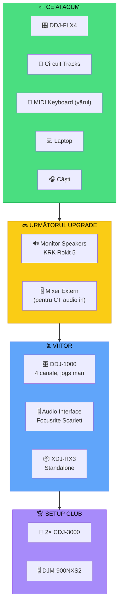

# 📈 Upgrade Path — Parcursul Echipamentului

[🏠 Home](../README.md) · [🔌 Echipament](../README.md#-echipament)

---

> **Pe scurt:** Ce ai acum, ce ai nevoie, și în ce ordine să faci upgrade.

---

## 🗺️ Parcursul Complet

---

## 📊 Prioritate Upgrade

| # | Ce | De Ce | Preț Aprox. | Urgență |
|---|-----|-------|------------|---------|
| 1 | **Monitor speakers** | Auriculare + boxe = mix mai bun | €150-300/pereche | 🟡 Mediu |
| 2 | **Mixer extern mic** | CT audio in + DDJ audio in | €100-200 | 🟡 Mediu |
| 3 | **Audio interface** | Low latency, mai multe input-uri | €100-200 | 🟢 Nu urgent |
| 4 | **DDJ-1000** sau **DDJ-FLX10** | 4 canale, 3-band EQ, jogs mari | €800-1200 | 🟢 Când ești sigur |
| 5 | **XDJ-RX3** | Standalone (fără laptop) | €1800-2000 | 🟢 Level club |
| 6 | **CDJ-3000 + DJM-900** | Setup de club | €5000+ | ⬜ Dacă ajungi pro |

---

## 🎚️ Mixere Externe Recomandate

Pentru a combina DDJ-FLX4 + Circuit Tracks + MIDI Keyboard:

| Mixer | Canale | Input | Preț | Recomandat |
|-------|--------|-------|------|-----------|
| Yamaha MG06X | 6 | 2 mic + 2 stereo | €80 | ✅ Buget |
| Behringer Xenyx 802 | 8 | 2 mono + 2 stereo | €70 | ✅ Buget |
| Mackie Mix5 | 5 | 1 mic + 2 stereo | €60 | ✅ Minim |
| Allen & Heath ZEDi-8 | 4 + USB | 2 mono + 2 stereo | €150 | ✅ Audio interface combo |

---

## ❌ Greșeli de Evitat

| Greșeală | De Ce e Greșită |
|----------|----------------|
| Cumperi CDJ-uri de club fără experiență | Nu te ajută skill — doar echipamentul |
| Upgrade prea repede | Învață pe ce ai, abia apoi upgrade |
| Cumperi scump fără mixer extern | Nu ai cum să combini CT + DDJ fără mixer |
| Ignori căștile | Căști bune > controller scump |
| Skip monitor speakers | Mixezi pe căști = oboseală + mix slab |

---

## ✅ Checklist Upgrade

**Momentul potrivit să faci upgrade când:**
- [ ] Poți mixa consistent 1h pe DDJ-FLX4
- [ ] Ai nevoie de mai mult de 2 canale
- [ ] Vrei să combini CT audio live
- [ ] Ești invitat la gig-uri regulate
- [ ] Setup-ul actual te limitează (nu e vorba de skill)

---

[🏠 Home](../README.md) · [🔌 Echipament](../README.md#-echipament)
