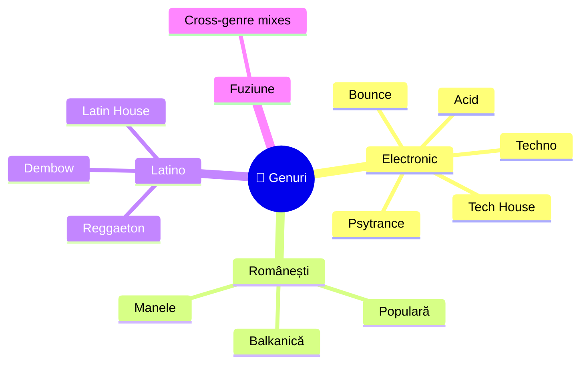
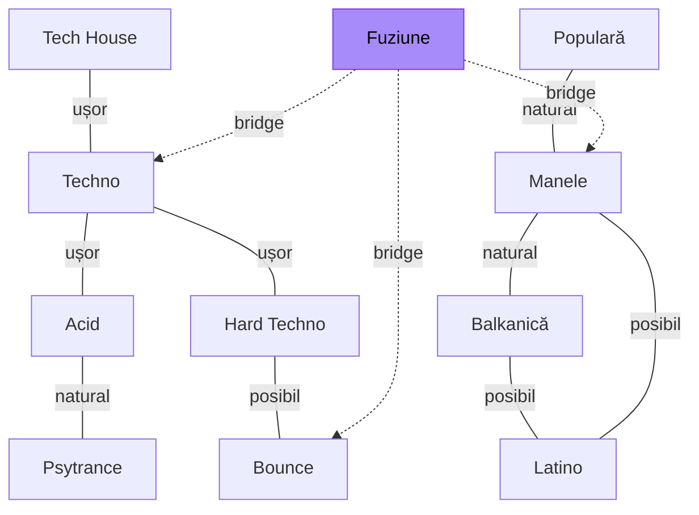

# 🎵 Genuri — Ghid Complet per Gen Muzical

[🏠 Home](../README.md)

---

> **Pe scurt:** Ghid detaliat per gen muzical — BPM, Key, mixing, structură,
> sub-genuri, și cum se combină cu alte genuri.

---

## 🗺️ Harta Genurilor

---

## 📊 Tabel Comparativ Rapid

| Gen | BPM | Energie | Vibe | Mixare cu |
|-----|-----|---------|------|-----------|
| [Techno](techno.md) | 125-145 | 🔥🔥🔥🔥 | Dark, industrial | Acid, Hard Techno |
| [Tech House](tech-house.md) | 122-128 | 🔥🔥🔥 | Groovy, cald | Techno, Deep House |
| [Acid](acid.md) | 125-140 | 🔥🔥🔥🔥 | Psychedelic, squelchy | Techno, Psy |
| [Psytrance](psytrance.md) | 138-150 | 🔥🔥🔥🔥🔥 | Trippy, cosmic | Acid, Hard Techno |
| [Bounce](bounce.md) | 150-165 | 🔥🔥🔥🔥🔥 | Hard, energic | Melbourne, Hard Dance |
| [Manele](manele.md) | 85-130 | 🔥🔥🔥 | Petrecere RO | Balkanică, Latino |
| [Populară](populara.md) | 80-140 | 🔥🔥 | Tradițional RO | Manele, Balkanică |
| [Balkanică](balkanica.md) | 90-160 | 🔥🔥🔥🔥 | Petrecere balkanică | Manele, Latino |
| [Latino](latino.md) | 85-130 | 🔥🔥🔥 | Tropical, sexy | Tech House, Manele |
| [Fuziune](fuziune.md) | Variabil | 🔥🔥🔥🔥 | Experimental | Totul! |

---

## 🔄 Compatibilitate între Genuri

---

[🏠 Home](../README.md)
