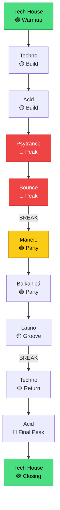

# 🔀 Fuziune — Cross-Genre Mixing

[🏠 Home](../README.md) · [🎵 Genuri](README.md)

---

> **Pe scurt:** Cum combini genuri diferite într-un set coerent.
> Aceasta e superputerea ta ca DJ — nimeni altcineva nu mixează
> techno + manele + bounce + acid.

---

## 🔀 Filozofia Fuziunii mwrty

---

## 🌉 Track-uri Punte (Bridge Tracks)

Track-uri care există la intersecția a 2 genuri:

| Punte | Gen A | Gen B | Ce Caută |
|-------|-------|-------|----------|
| **Tribal Tech** | Tech House | Latino | Percuție latină + tech groove |
| **Acid Psy** | Acid | Psytrance | 303 bassline + psy atmosphere |
| **Balkan Beats** | Balkanică | Techno | Brass + electronic beat |
| **Manele Remix (Techno)** | Manele | Techno | Vocal manea + techno production |
| **Latin House** | Latino | Tech House | Reggaeton vocals + house beat |
| **Hard Psy** | Hard Techno | Psytrance | 140-145 BPM overlap |

---

## 📊 Matrice Fuziune

| → De la \ La → | TH | Techno | Acid | Psy | Bounce | Manele | Balk | Latino |
|---|---|---|---|---|---|---|---|---|
| **Tech House** | - | 🟢 | 🟡 | 🔴 | 🔴 | 🔴 | 🔴 | 🟡 |
| **Techno** | 🟢 | - | 🟢 | 🟡 | 🔴 | 🔴 | 🟡 | 🔴 |
| **Acid** | 🟡 | 🟢 | - | 🟢 | 🔴 | 🔴 | 🔴 | 🔴 |
| **Psy** | 🔴 | 🟡 | 🟢 | - | 🟡 | 🔴 | 🔴 | 🔴 |
| **Bounce** | 🔴 | 🔴 | 🔴 | 🟡 | - | 🔴 | 🔴 | 🔴 |
| **Manele** | 🔴 | 🔴 | 🔴 | 🔴 | 🔴 | - | 🟢 | 🟡 |
| **Balkanică** | 🔴 | 🟡 | 🔴 | 🔴 | 🔴 | 🟢 | - | 🟡 |
| **Latino** | 🟡 | 🔴 | 🔴 | 🔴 | 🔴 | 🟡 | 🟡 | - |

🟢 Ușor | 🟡 Posibil cu punte | 🔴 Break necesar

---

## 🛠️ Tehnici de Trecere între "Lumi"

### 1. **Clean Break**
Cel mai sigur. Fade out → 2-4 secunde liniște → track nou.

### 2. **FX Bridge**
Reverb wash / echo trail pe final → track complet diferit.

### 3. **Acapella Bridge**
Vocal-ul de la gen A peste instrumental-ul gen B.

### 4. **Drum Break**
Reduce la doar drums → introduce drums noi → rebuild.

### 5. **CT Bridge** (Circuit Tracks)
CT solo (synth pad sau beat neutral) → blend in gen nou.

---

## 📝 Reguli de Aur Fuziune

1. **Fiecare bloc de gen = minim 3-4 track-uri** (nu sări gen la gen)
2. **Schimbă BPM gradual** (max ±5 BPM per tranziție)
3. **Break-uri curate** între genuri incompatibile
4. **Citește publicul** — dacă dansează pe manele, nu pune techno
5. **Pregătește punte-le** — deja în playlist, gata de blend

---

[🏠 Home](../README.md) · [🎵 Genuri](README.md)
