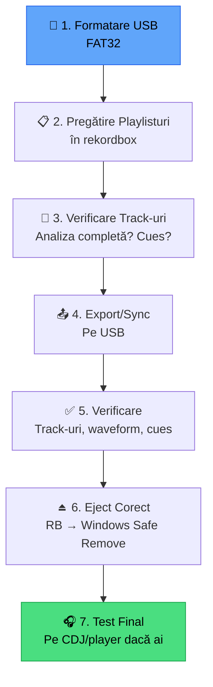

# 💾 Export USB — Ghid Complet

[🏠 Home](../README.md) · [📁 Organizare](README.md)

---

> **Pe scurt:** Tot ce trebuie să știi despre export USB —
> de la formatare la verificare la troubleshooting.

---

## 🔄 Procesul Complet

---

## 💾 Formatare

### Windows (FAT32 sub 32GB):
1. Click dreapta pe USB → Format
2. File System: **FAT32**
3. Quick Format ✅

### Windows (FAT32 peste 32GB):
Windows nu oferă FAT32 peste 32GB nativ. Folosește:
- **Rufus** (gratuit) — poate formata FAT32 pe orice dimensiune
- **Fat32Format** (gratuit) — dedicat FAT32

> **Recomandare finală:** USB de **32GB FAT32** = cel mai sigur.

---

## 📤 Export din Rekordbox

### Metoda Drag & Drop:
1. Conectează USB → apare în **Devices**
2. Drag playlist din sidebar → Drop pe USB

### Metoda Sync Manager:
1. Conectează USB
2. Click **Sync Manager** (↔️)
3. Selectează playlisturi de sincronizat
4. Click **Sync**

### Ce Se Exportă:

| Element | Se exportă? |
|---------|-------------|
| Track-uri audio | ✅ Da (copie fizică) |
| Hot Cues | ✅ Da |
| Memory Cues | ✅ Da |
| Loops | ✅ Da |
| Beatgrid | ✅ Da |
| Waveform | ✅ Da |
| Playlisturi | ✅ Da |
| Rating | ✅ Da |
| Color Labels | ✅ Da |
| My Tag | ✅ Da |
| Comments | ✅ Da |

---

## ⚠️ Troubleshooting Export

| Problemă | Cauză | Soluție |
|----------|-------|---------|
| USB nu apare în RB | Format NTFS | Reformatează FAT32 |
| Export eșuează | Spațiu insuficient | Șterge track-uri sau USB mai mare |
| Track-uri lipsă pe CDJ | Export incomplet | Re-export play playlist |
| Waveform lipsă | Nu s-a exportat analiza | Re-export cu analiză activată |
| Erori la eject | Fișier în uz | Închide toate aplicațiile, retry |

---

## ✅ Checklist Export

- [ ] USB formatat FAT32
- [ ] Playlisturi pregătite (ordonate, cu cues)
- [ ] Export reușit (no errors)
- [ ] Verificare: track-uri, waveform, cues prezente
- [ ] Eject din rekordbox + Safe Remove Windows
- [ ] USB backup identic

---

[🏠 Home](../README.md) · [📁 Organizare](README.md)
