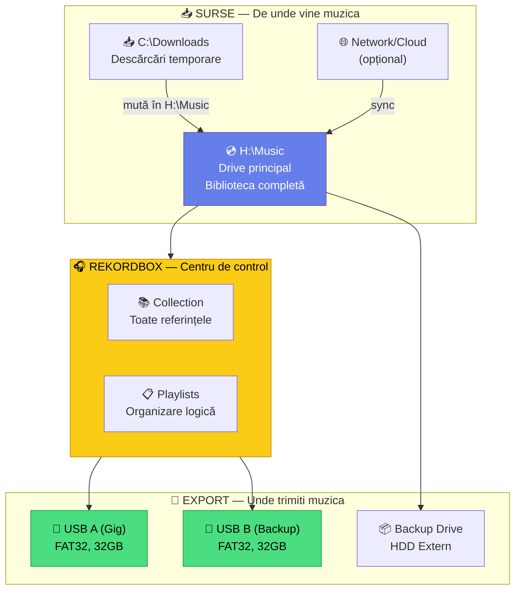
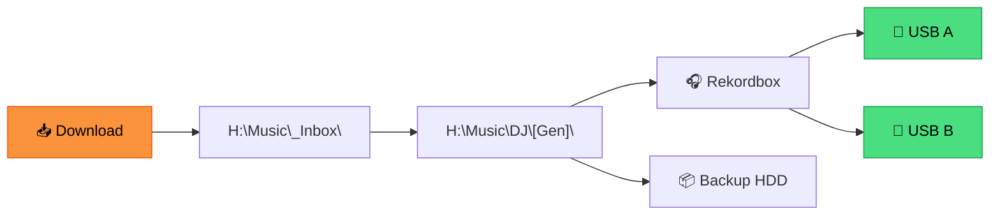

# 💿 Gestionare Drive-uri — Multiple Surse & Export-uri

[🏠 Home](../README.md) · [📁 Organizare](README.md)

---

> **Pe scurt:** Cum gestionezi mai multe drive-uri, surse de muzică,
> și drive-uri de export USB.

---

## 🗺️ Harta Drive-urilor

---

## 💿 Tipuri de Drive-uri

### 1. Drive Principal (H:\Music)

| Atribut | Valoare |
|---------|---------|
| **Rol** | Biblioteca completă — sursa de adevăr |
| **Format** | NTFS (Windows) |
| **Conținut** | Toate fișierele audio organizate |
| **Backup** | Da — pe HDD extern + cloud |

### 2. Drive-uri USB Export

| Atribut | USB A (Gig) | USB B (Backup) |
|---------|-------------|----------------|
| **Rol** | USB principal pentru gig | Copie identică |
| **Format** | FAT32 | FAT32 |
| **Conținut** | Playlisturi selectate | Identic cu USB A |
| **Capacitate** | 32 GB | 32 GB |

### 3. Drive Backup

| Atribut | Valoare |
|---------|---------|
| **Rol** | Backup complet (muzică + database) |
| **Format** | NTFS |
| **Frecvență** | Lunar |
| **Conținut** | H:\Music + rekordbox DB |

---

## 🔄 Workflow Multi-Drive

---

## ⚠️ Reguli Importante

| Regulă | De Ce |
|--------|-------|
| **Un singur drive principal** | O singură sursă de adevăr |
| **Nu muta fișiere după import RB** | Evită "file not found" |
| **FAT32 pe USB-uri export** | Compatibilitate maximă CDJ |
| **Backup regulat** | Nu pierzi ani de muncă |
| **Etichetează USB-urile fizic** | "mwrty-A", "mwrty-B" |

---

## 📋 Dacă Adaugi Un Drive Nou

1. Decide **rolul** (sursă, export, backup)
2. **Formatează** corect (NTFS pentru sursă, FAT32 pentru export)
3. **Adaugă** ca sursă monitorizată (în workflow de scanare)
4. **Documentează** în acest ghid

---

## 🔒 Drive-uri Viitoare (Roadmap)

| Când | Ce | De Ce |
|------|-----|-------|
| **Acum** | H:\Music + 2 USB | Setup minimal funcțional |
| **Când creste biblioteca** | HDD Extern 1TB | Storage mai mare |
| **Pro** | NAS / Cloud Sync | Acces de pe mai multe device-uri |
| **Studio** | SSD dedicat sampling | Acces rapid pentru producție |

---

## ✅ Checklist

- [ ] H:\Music e drive-ul principal pentru muzică
- [ ] Am 2 USB-uri FAT32 pentru gig-uri
- [ ] Am un plan de backup
- [ ] Știu ce format folosesc pe fiecare drive
- [ ] Nu am muzică neorganizată pe drive-uri random

---

[🏠 Home](../README.md) · [📁 Organizare](README.md)
