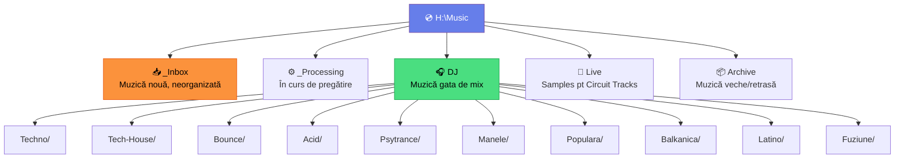

# 📂 Structură Foldere — Organizare pe Disk

[🏠 Home](../README.md) · [📁 Organizare](README.md)

---

> **Pe scurt:** Cum organizezi fizic fișierele audio pe disk-ul H:\Music
> și pe alte drive-uri. Baza organizării tale.

---

## 🗂️ Structura Recomandată



### Structura Completă:

```
H:\Music\
│
├── _Inbox\                    ← ⬇️ Muzică proaspăt descărcată
│   ├── 2025-04\               ← Subfolder per lună (opțional)
│   └── unsorted\
│
├── _Processing\               ← ⚙️ Track-uri în curs de pregătire
│
├── DJ\                        ← 🎧 Muzică analizată & pregătită
│   ├── Techno\
│   │   ├── Hard-Techno\
│   │   └── Minimal\
│   ├── Tech-House\
│   ├── Bounce\
│   │   ├── Hard-Bounce\
│   │   └── Melbourne-Bounce\
│   ├── Acid\
│   ├── Psytrance\
│   │   ├── Full-On\
│   │   └── Dark-Psy\
│   ├── Manele\
│   │   ├── Manele-Club\
│   │   └── Manele-Clasice\
│   ├── Populara\
│   │   ├── Hora\
│   │   └── Modern\
│   ├── Balkanica\
│   ├── Latino\
│   │   ├── Reggaeton\
│   │   └── Cumbia\
│   ├── Fuziune\                ← Track-uri care combină genuri
│   └── _Compilatii\           ← Pack-uri/compilații nedesfăcute
│
├── Live\                      ← 🎹 Samples pentru Circuit Tracks
│   ├── Drums\
│   ├── Synths\
│   ├── FX\
│   └── Vocals\
│
├── Archive\                   ← 📦 Track-uri retrase din rotație
│
└── _Export\                   ← 💾 Backup-uri export USB
    ├── USB-001_2025-04-10\
    └── USB-002_2025-04-14\
```

---

## 📏 Reguli

| Regulă | De Ce |
|--------|-------|
| **Un fișier = un singur folder** | Evită duplicări |
| **`_` prefix** pe foldere utility | Le pune primele în lista |
| **Gen principal = folder principal** | Ușor de găsit |
| **Sub-gen = subfolder** | Granularitate fără complicație |
| **Inbox → Processing → DJ** | Flow clar de la nou la pregătit |
| **Archive, nu Delete** | Poți reveni la track-uri vechi |

---

## 🔄 Flow-ul unui Track Nou


1. **Download** → pui în `_Inbox/`
2. **Import** în rekordbox din `_Inbox/`
3. **Analiză + Cue points + Taguri**
4. **Muți** fișierul din `_Inbox/` în `DJ/[Gen]/`
5. **Relocalizezi** în rekordbox (dacă ai mutat după import)
6. Track-ul e **gata de mix**!

> **💡 Best practice:** Mută fișierul în folderul final **ÎNAINTE** de a importa
> în rekordbox — evită relocalizarea.

---

## ✅ Checklist

- [ ] Am structura de foldere creată pe H:\Music
- [ ] Folosesc _Inbox pentru muzică nouă
- [ ] Fiecare track e într-un singur folder
- [ ] Am Archive pentru track-uri scoase din rotație
- [ ] Follow flow: Download → Inbox → Processing → DJ/Gen

---

[🏠 Home](../README.md) · [📁 Organizare](README.md)
