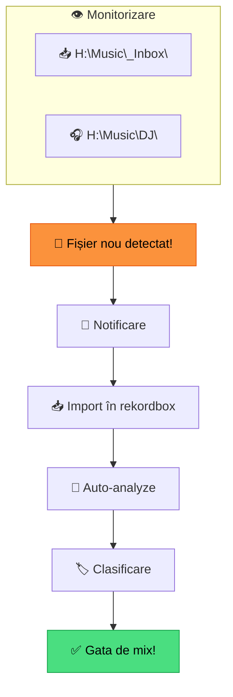
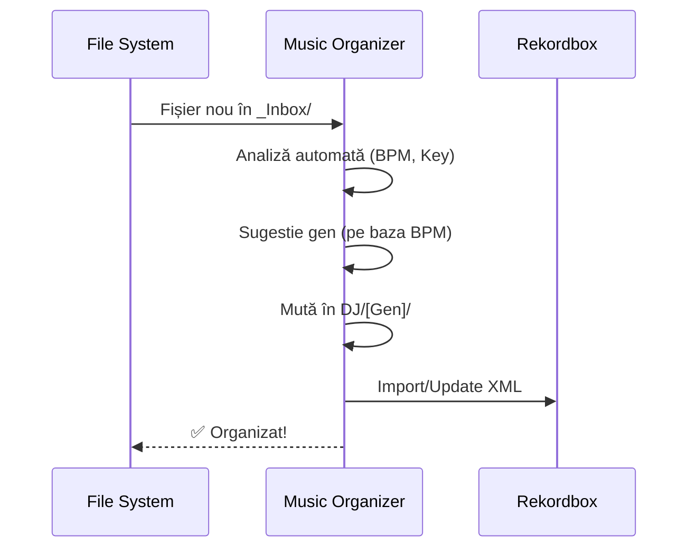

# 🔍 Workflow Scanare — Auto-Scan & Watch Folders

[🏠 Home](../README.md) · [📁 Organizare](README.md)

---

> **Pe scurt:** Cum monitorizezi automat folderele pentru muzică nouă
> și workflow-ul de integrare cu rekordbox.

---

## 🔄 Conceptul Watch Folder

---

## 📋 Workflow Scanare Manuală (Actual)

Până când vei avea aplicația, workflow-ul manual:

### Săptămânal:

1. **Verifică `_Inbox/`** — ce e nou?
2. **Import în rekordbox** — drag & drop folder
3. **Verifică analiză** — BPM și Key corecte?
4. **Setează taguri** — gen, energie, mood
5. **Setează cue points** — minim Hot Cue 1 (First Beat)
6. **Mută** din `_Inbox/` în `DJ/[Gen]/`
7. **Relocalizează** în rekordbox dacă ai mutat fișierul

### La Fiecare Download:

1. **Save** direct în `H:\Music\_Inbox\`
2. Task: procesează în sesiunea următoare

---

## 🤖 Auto-Monitor cu Aplicația (Viitor)

Aplicația Music Organizer va automatiza:

> **📋 Detalii:** [App Music Organizer](../app/README.md)

---

## 📁 Foldere de Monitorizat

| Folder | Scop | Frecvență Verificare |
|--------|------|---------------------|
| `H:\Music\_Inbox\` | Muzică nouă descărcată | Zilnic/Săptămânal |
| `H:\Music\DJ\` | Biblioteca principală | La fiecare import |
| `Downloads\` | Descărcări browser | Verificare → mută în _Inbox |
| USB export drives | Verificare sincronizare | Înainte de gig |

---

## ✅ Checklist

- [ ] Am un workflow clar de scanare (săptămânal)
- [ ] _Inbox e golită regulat (nimic nu stă mai mult de 2 săptămâni)
- [ ] Fiecare track importat e complet procesat (analiză + taguri + cues)
- [ ] Nu am track-uri orfane (file not found) în rekordbox

---

[🏠 Home](../README.md) · [📁 Organizare](README.md)
